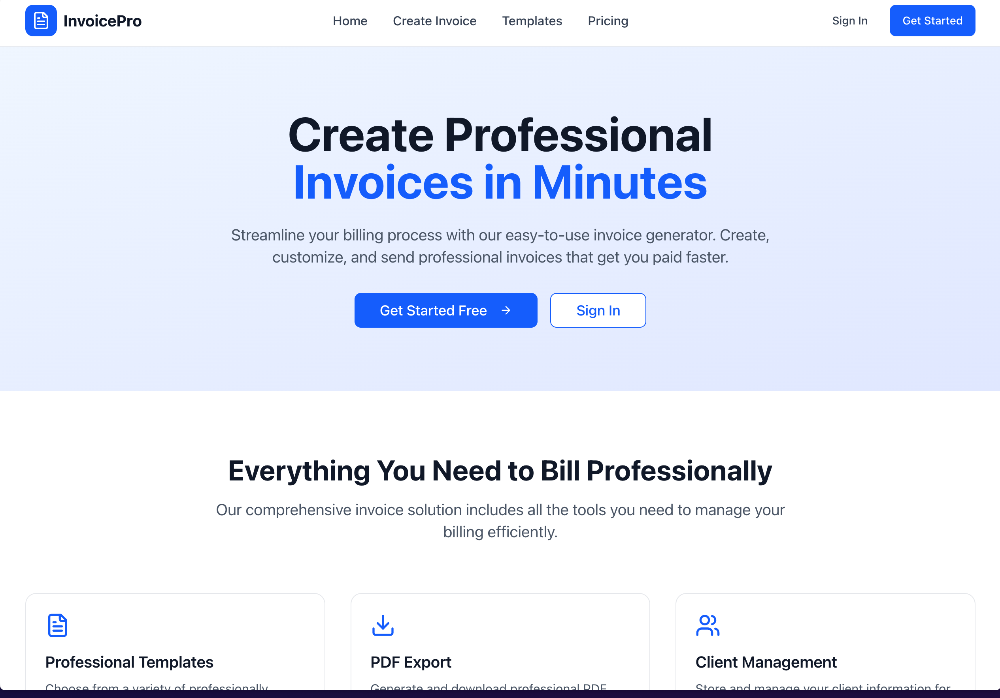
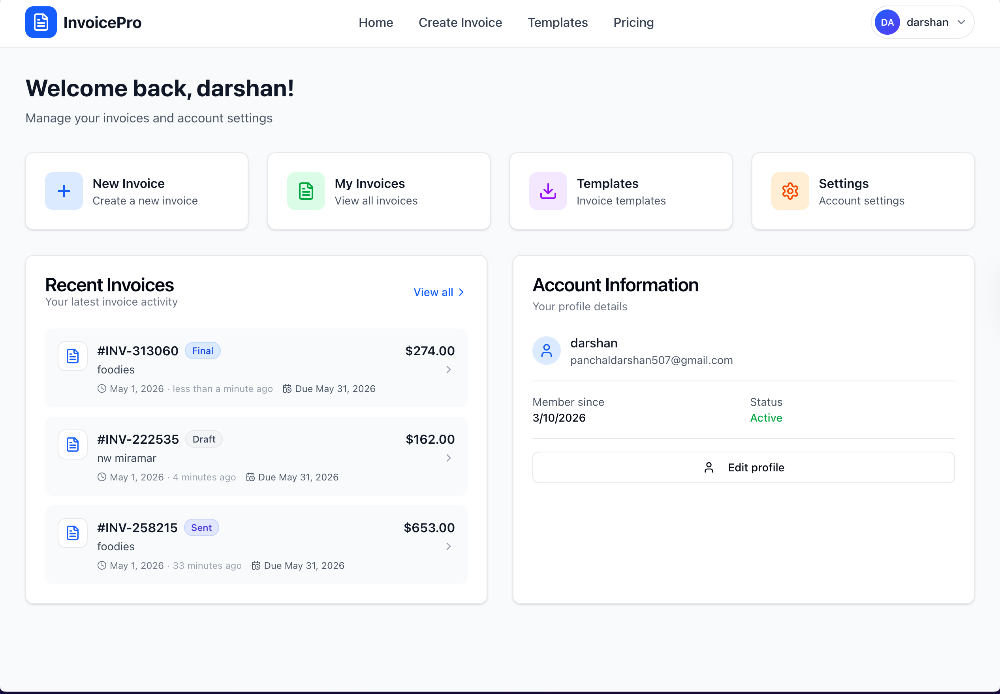
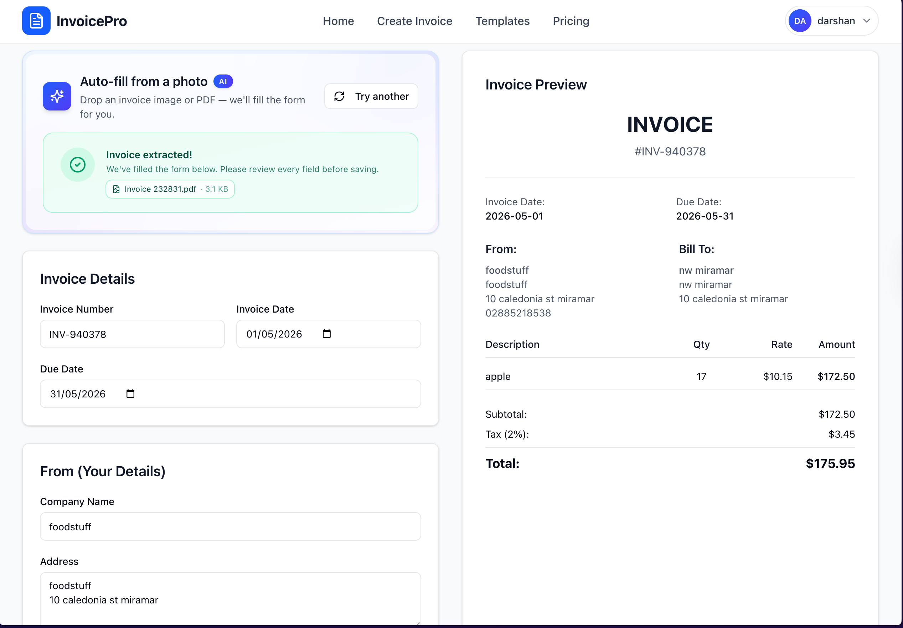
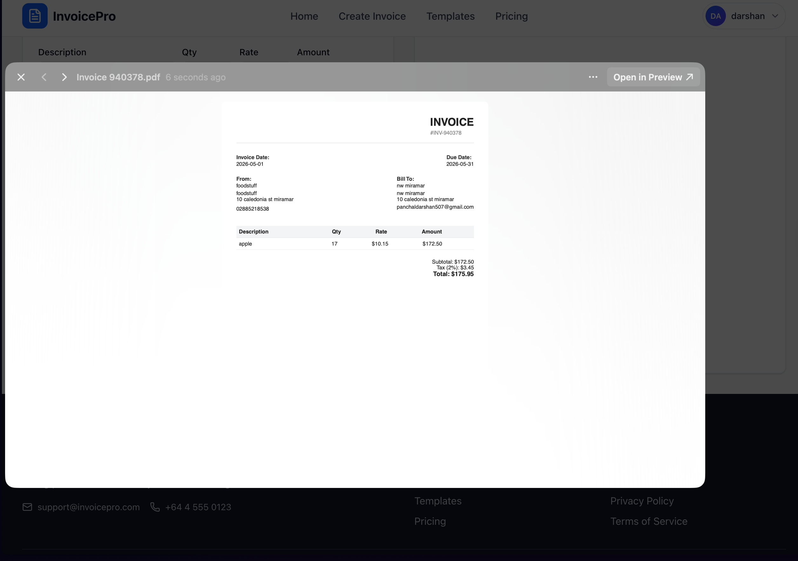

# InvoicePro

> Snap a receipt, get a polished invoice. **InvoicePro** turns scanned bills and receipts into branded, downloadable PDF invoices in seconds — powered by AWS Textract OCR, Supabase auth, and Resend email delivery.

🌐 **Live demo:** https://invoice-creator-ashen.vercel.app
📦 **Repo:** https://github.com/parzivaldrp/invoice-creator

---

## What it does

Most invoice generators ask you to type everything in. InvoicePro flips that: you upload a photo of a receipt or an existing invoice PDF, **AWS Textract** parses out the vendor, line items, totals, and dates, and the form is pre-filled for you. Edit, save, download as PDF, or email it directly to the client.

A 60-second tour:

1. Sign up (or use Google sign-in)
2. Upload a receipt photo / PDF — or skip the upload and fill the form manually
3. Textract extracts vendor, line items, totals, dates → form pre-fills
4. Adjust line items, tax rate, due date
5. Save as draft, mark final, send via email, or download a polished PDF

## Screenshots


| Landing | Dashboard |
|---|---|
|  |  |

| Invoice generator (with Textract upload) | Generated PDF |
|---|---|
|  |  |

## Key features

- **AI receipt extraction** — upload a JPG, PNG, or PDF and AWS Textract's `AnalyzeExpense` parses out vendor, line items, dates, totals, and tax. Auto-populates the invoice form.
- **Polished PDF generation** — invoices render via `@react-pdf/renderer` so the downloaded file matches the on-screen preview pixel for pixel.
- **Email delivery** — send invoices directly to clients via [Resend](https://resend.com), with the PDF attached.
- **Auth + per-row data isolation** — Supabase Auth with cookie-based sessions; database access gated by Postgres Row Level Security so users physically cannot read each other's data.
- **Edge-protected routes** — Next.js middleware verifies the session JWT on every request to protected paths, redirecting unauthenticated users before any page code runs.
- **Cost protection on the AI** — per-user rolling 24-hour rate limit (25 extractions/day), file-type and 5 MB size checks, an environment-variable kill switch, and fail-closed semantics so a usage-table read failure refuses extraction rather than silently bypassing the cap.
- **Status workflow** — draft → final → sent → paid → overdue → cancelled, with overdue badges driven by date logic.
- **Search, filter, sort** — full-text search across invoice number / company / email / notes; status filter; sort by issue date / due date / amount / invoice number.

## Tech stack

| Layer | Choice | Why |
|---|---|---|
| Framework | Next.js 16 (App Router, Turbopack) | Server components, edge middleware for auth, fast dev feedback |
| Language | TypeScript | Type safety against the Supabase + Textract response shapes |
| UI | Tailwind CSS 4 + custom shadcn-style primitives | Speed of iteration without a heavy component library |
| Auth + DB | Supabase (Postgres + Auth + RLS) | Single managed service for auth, database, and per-row authorization |
| OCR | AWS Textract (`AnalyzeExpense`) | Purpose-built for receipts/invoices — far better than generic OCR |
| PDF | `@react-pdf/renderer` | Declarative React → PDF, no headless browser overhead |
| Email | Resend | Clean API, generous free tier, native attachment support |
| Animation | Framer Motion | Smooth list mount/exit transitions on the invoices grid |
| Hosting | Vercel (Sydney region) | Co-located with AWS Textract `ap-southeast-2` for low latency |

## Architecture & engineering decisions

A few of the calls I made and why — happy to walk through any of these in an interview.

### Cookie-based Supabase sessions, not localStorage

The browser client uses `@supabase/ssr`'s `createBrowserClient`, which stores the session in cookies instead of localStorage. This unlocks two things: (1) edge middleware can read the same session from cookies and gate routes _before_ page code runs, and (2) the JWT isn't sitting in localStorage where any third-party script could read it.

### Edge middleware uses `getUser()`, not `getSession()`

`getSession()` trusts whatever cookie the client sends. `getUser()` forces a server round-trip to verify the JWT against Supabase. The added latency is the price of defense against forged or expired tokens. See [`src/lib/supabase/middleware.ts`](./src/lib/supabase/middleware.ts).

### Textract route fails closed

If reading the rate-limit table errors, the route returns 503 instead of letting the call through. Better to refuse a single request than silently lose the cap and run up an AWS bill. See [`src/app/api/extract-invoice/route.ts`](./src/app/api/extract-invoice/route.ts).

### `@react-pdf/renderer` is server-externalized + dynamically imported

The library is heavy (1–2 MB). It's listed in `next.config.ts` as a `serverExternalPackages` entry so it doesn't get bundled into client JS, and on the dashboard it's loaded with a dynamic `import()` only when the user actually clicks "Download PDF". First paint on the invoice list isn't penalised for a feature most users won't trigger immediately.

### Schema-first data scoping via RLS

Rather than scattering `where user_id = ?` checks across every API handler, RLS policies on the `invoices`, `invoice_items`, and `extract_usage` tables enforce ownership at the database level. App-side filters are added defensively, but the database is the source of truth.

## Engineering highlights / challenges solved

These are real bugs and decisions I hit while building this — the kind of stuff that makes for good interview talking points.

- **Next.js 16 async params bug** — dynamic route handlers' `params` became a `Promise` in Next 15+. Synchronous destructuring silently produced `undefined` IDs, which Mongo/Postgres then rejected as "invalid". Fix: `const { id } = await params;`.
- **Auth-blocking landing page** — the marketing page was wrapped in `if (loading) return <Loading />`, which made every first-time visitor wait on a Supabase round-trip before seeing the hero. Removed the gate, kept the redirect-on-authenticated, dropped first paint to instant.
- **Custom Select dropdown was rendering its panel inline, always** — the `<SelectContent>` had no open-state gating, so its items dumped into the page flow on load. That ballooned the dropdown's grid cell, which stretched the search input's grid cell, which pushed the absolutely-positioned search icon halfway down the page. Rebuilt the component using React Context so the trigger and content share a single `isOpen` boolean.
- **Region mismatch tax** — Vercel function in Sydney calling Textract in `us-east-1` was eating ~250ms per request crossing the Pacific. Moved both to `ap-southeast-2`.

## Project structure

```
src/
├── app/
│   ├── api/                # route handlers (extract-invoice, send-invoice)
│   ├── dashboard/          # signed-in home
│   ├── invoice_generator/  # form + Textract upload + InvoicePDF
│   ├── myInvoice/          # list, search, filter, sort
│   ├── InvoiceDetailPage/  # single invoice view
│   ├── login/, signUp/, profile/, billing/, ...
│   ├── layout.tsx          # root layout, AuthProvider mounts here
│   └── page.tsx            # public marketing page
├── components/
│   ├── ui/                 # button, input, select, card, etc.
│   ├── invoices/           # invoice card, stats, status badge
│   ├── Navbar.tsx, Footer.tsx, ProtectedRoute.tsx
├── lib/
│   ├── supabaseClient.ts   # browser client (cookie-based)
│   ├── supabase/server.ts  # server-side client for route handlers
│   ├── supabase/middleware.ts  # edge session refresh + route gating
│   ├── authContext.tsx     # AuthProvider, useAuth()
│   └── validateInvoice.ts
├── middleware.ts           # entry point — wires updateSession into matcher
docs/                       # SQL setup, RLS policies, troubleshooting notes
```

## Local development

### Prerequisites

- Node 20+
- A Supabase project (free tier is fine)
- An AWS account with Textract enabled in your region
- A Resend API key (free tier is fine)

### Setup

```bash
git clone https://github.com/parzivaldrp/invoice-creator.git
cd invoice-creator
npm install
```

### Environment variables

Create a `.env.local` file at the project root:

```bash
NEXT_PUBLIC_SUPABASE_URL=https://YOUR_PROJECT.supabase.co
NEXT_PUBLIC_SUPABASE_ANON_KEY=eyJ...
RESEND_API_KEY=re_...
AWS_REGION=ap-southeast-2
AWS_ACCESS_KEY_ID=AKIA...
AWS_SECRET_ACCESS_KEY=...
# Optional kill switch — set to "true" to disable Textract globally
# EXTRACT_DISABLED=false
```

### Database setup

The Supabase schema and RLS policies are in [`docs/`](./docs/). Apply them in the Supabase SQL editor in this order:

1. `docs/supabase-setup.sql` — tables (invoices, invoice_items, profiles, extract_usage)
2. `docs/fix-rls-policy.sql` — Row Level Security policies

### Run it

```bash
npm run dev          # starts on http://localhost:3000
npm run check:types  # typescript check, no emit
npm run check:rls    # custom script that verifies RLS policies are active
npm run build        # production build
```

## Roadmap

- [ ] Demo account / "Try without signup" button (lower friction for evaluators)
- [ ] Recurring invoices (cron-driven)
- [ ] Multi-currency support with FX rate caching
- [ ] Stripe payment links embedded in sent invoices
- [ ] Mobile app (React Native, sharing the Supabase backend)
- [ ] Bulk-import historical invoices via Textract
- [ ] Test coverage (Vitest unit + Playwright E2E happy path)

## About

Built by [Darshan Panchal](https://github.com/parzivaldrp) — see my [portfolio](https://github.com/parzivaldrp) for more projects.

Open to junior / entry-level frontend or full-stack roles. Looking to learn under experienced engineers and ship real things. Reach out: panchaldarshan507@gmail.com.

---

_This project is for learning and portfolio purposes. The deployed instance is a live demo — don't put real customer data into it._
