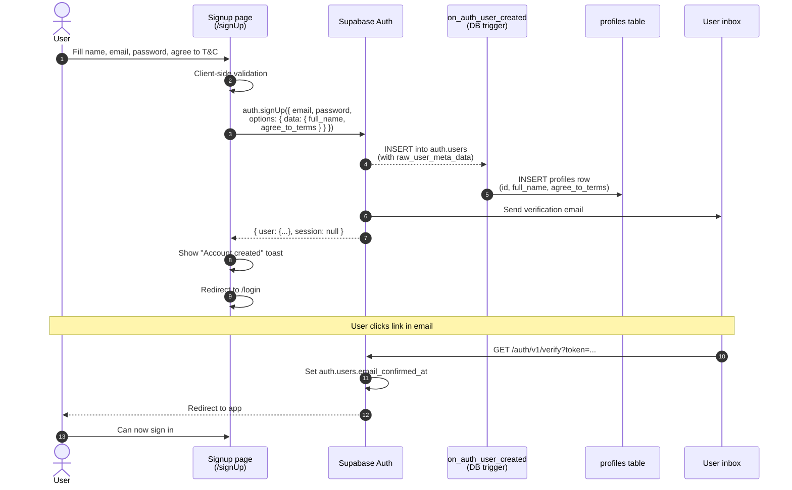
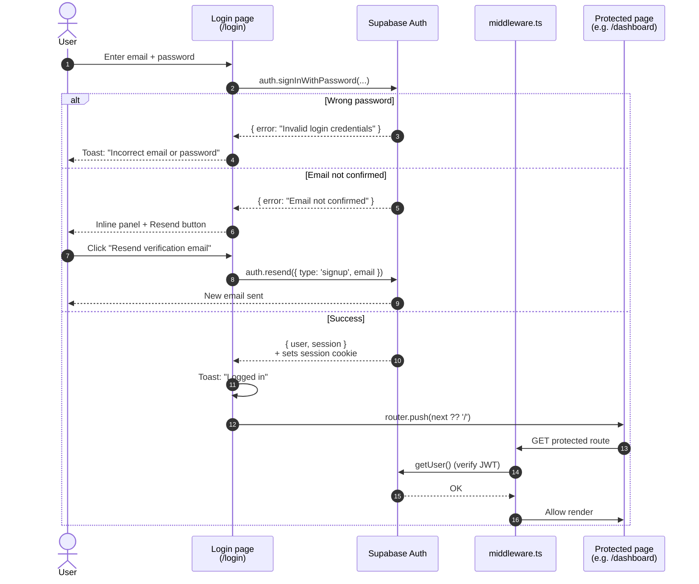
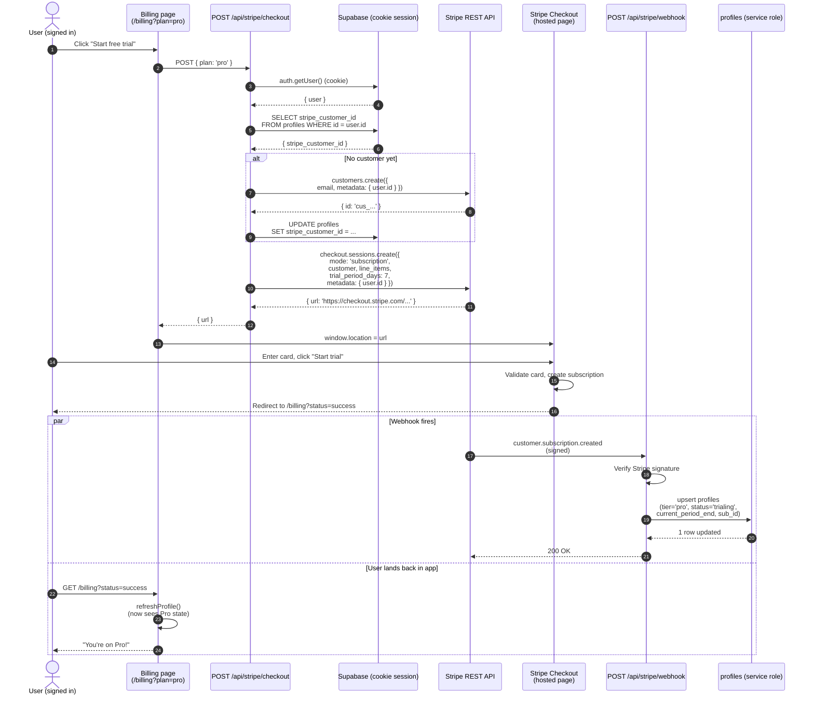
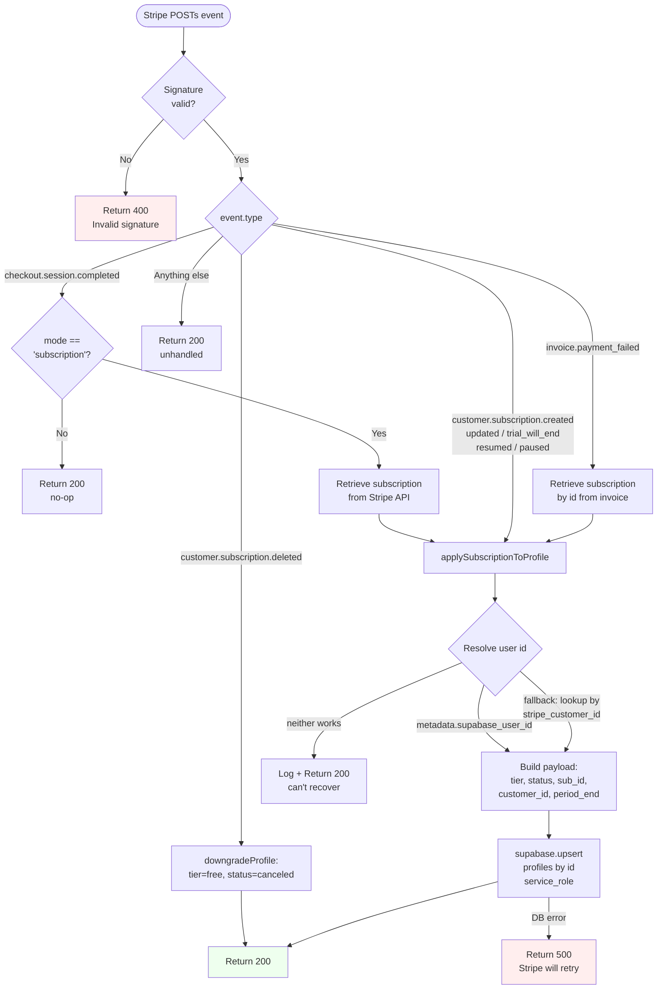
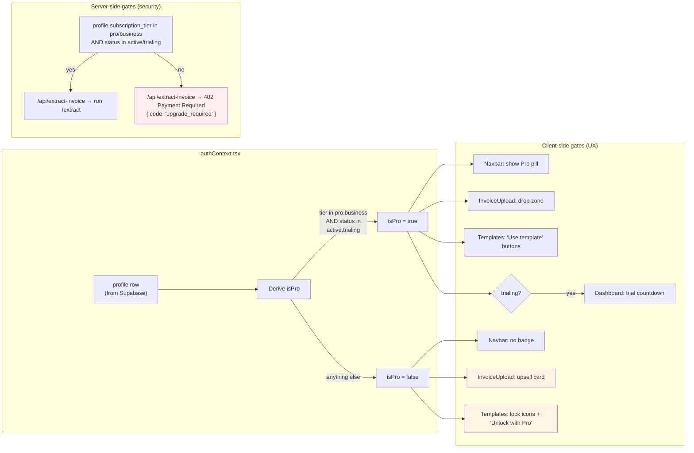
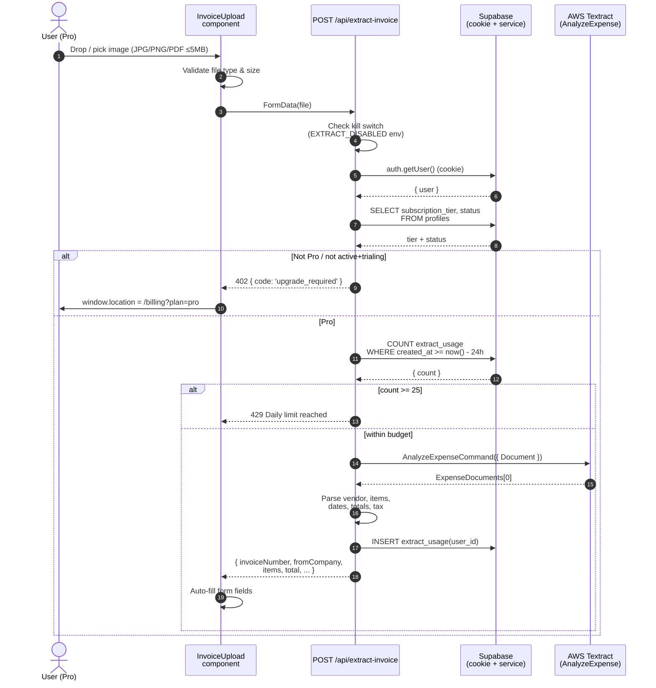
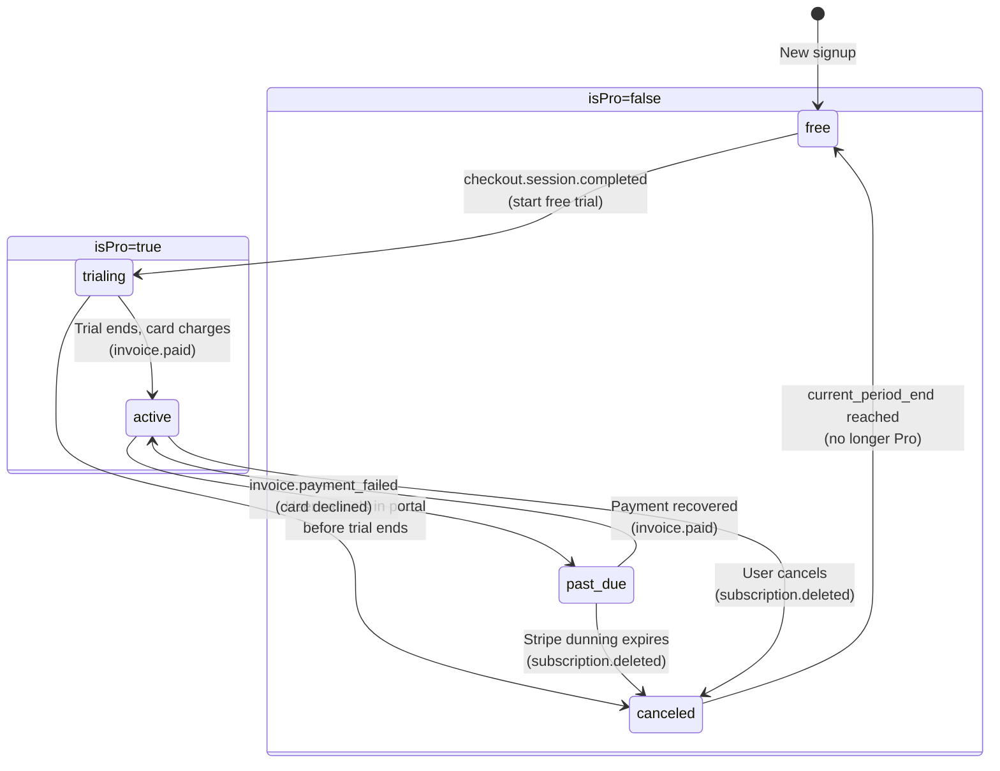

# InvoicePro — Architecture & Diagrams

All diagrams below use [Mermaid](https://mermaid.js.org) — they render
natively in GitHub, GitLab, VS Code (with the *Markdown Preview Mermaid
Support* extension), Notion, Obsidian, and most modern doc tools.

Sections:

1. [System architecture](#1-system-architecture) — what talks to what
2. [Database (ER) diagram](#2-database-er-diagram) — Supabase schema
3. [Sign-up & email verification flow](#3-sign-up--email-verification-flow)
4. [Sign-in flow](#4-sign-in-flow)
5. [Pro subscription / Stripe checkout flow](#5-pro-subscription--stripe-checkout-flow)
6. [Stripe webhook → DB update flow](#6-stripe-webhook--db-update-flow)
7. [Feature gating (Pro vs Free)](#7-feature-gating-pro-vs-free)
8. [AI invoice extraction flow](#8-ai-invoice-extraction-flow)
9. [Subscription state machine](#9-subscription-state-machine)

---

## 1. System architecture

High-level view of every system InvoicePro talks to.

```mermaid
flowchart LR
  subgraph Client["Browser"]
    UI["Next.js 16 App<br/>(React 19)"]
  end

  subgraph App["Next.js Server (Vercel / localhost)"]
    Middleware["middleware.ts<br/>(auth gate + session refresh)"]
    Pages["App Router pages<br/>(server components)"]
    APIs["API routes<br/>/api/stripe/*<br/>/api/extract-invoice<br/>/api/send-invoice"]
  end

  subgraph Supabase["Supabase"]
    Auth["Auth<br/>(users + sessions)"]
    DB[("Postgres<br/>profiles, invoices,<br/>invoice_items,<br/>extract_usage")]
    RLS["Row-Level Security<br/>policies"]
  end

  subgraph External["External services"]
    Stripe["Stripe<br/>(Checkout, Billing<br/>Portal, Webhooks)"]
    Textract["AWS Textract<br/>(AnalyzeExpense)"]
    Resend["Resend<br/>(email delivery)"]
  end

  UI <-->|HTTPS| Middleware
  Middleware --> Pages
  Middleware --> APIs
  Pages -->|cookie-scoped client| Auth
  Pages -->|cookie-scoped client| DB
  APIs -->|cookie-scoped client| Auth
  APIs -->|cookie-scoped client| DB
  APIs -.->|service-role only,<br/>from webhook handler| DB
  DB --- RLS

  UI -->|Stripe.js redirect| Stripe
  APIs -->|REST calls<br/>(checkout, portal)| Stripe
  Stripe -.->|Webhook<br/>POST /api/stripe/webhook| APIs

  APIs -->|AnalyzeExpense| Textract
  APIs -->|emails.send| Resend
```

---

## 2. Database (ER) diagram

Supabase schema. Black diamonds = primary keys; FK arrows = foreign key
references. All tables have RLS enabled.

```mermaid
erDiagram
  AUTH_USERS ||--|| PROFILES : "1:1<br/>(id matches)"
  AUTH_USERS ||--o{ INVOICES : "user_id"
  AUTH_USERS ||--o{ EXTRACT_USAGE : "user_id"
  INVOICES ||--o{ INVOICE_ITEMS : "invoice_id"

  AUTH_USERS {
    uuid id PK
    text email
    timestamptz email_confirmed_at
    jsonb raw_user_meta_data "full_name, agree_to_terms"
    timestamptz created_at
  }

  PROFILES {
    uuid id PK_FK "= auth.users.id"
    text full_name
    boolean agree_to_terms
    text stripe_customer_id UK "cus_..."
    text stripe_subscription_id UK "sub_..."
    text subscription_status "trialing | active | canceled | past_due | ..."
    text subscription_tier "free | pro | business"
    timestamptz current_period_end
    timestamptz created_at
    timestamptz updated_at
  }

  INVOICES {
    uuid id PK
    uuid user_id FK
    text invoice_number "unique per user"
    text status "draft | final | sent | paid | overdue | cancelled"
    date issue_date
    date due_date
    text from_company
    text from_address
    text from_email
    text from_phone
    text to_company
    text to_address
    text to_email
    text notes
    numeric tax_rate
    numeric total
    text pdf_url
    timestamptz created_at
    timestamptz updated_at
  }

  INVOICE_ITEMS {
    uuid id PK
    uuid invoice_id FK
    text description
    numeric quantity
    numeric rate
    numeric amount
    timestamptz created_at
  }

  EXTRACT_USAGE {
    uuid id PK
    uuid user_id FK
    timestamptz created_at "for 24h rate limiting"
  }
```

**Key constraints & triggers:**

- `on_auth_user_created` (trigger on `auth.users` INSERT): reads
  `raw_user_meta_data` and inserts the matching `profiles` row.
- `subscription_tier` has a `CHECK` constraint: only `free`, `pro`,
  `business` are accepted.
- `current_period_end` is written by the Stripe webhook, not the user.
- `extract_usage.created_at` index supports the 24h rolling rate limit
  on `/api/extract-invoice`.

---

## 3. Sign-up & email verification flow



---

## 4. Sign-in flow



---

## 5. Pro subscription / Stripe checkout flow

End-to-end: user clicks Upgrade → lands on Stripe Checkout → webhook
updates DB → UI unlocks.



---

## 6. Stripe webhook → DB update flow

Detailed view of what happens inside `/api/stripe/webhook` for the
events we handle.



---

## 7. Feature gating (Pro vs Free)

How the same code paths behave differently based on `isPro`. The server
is the security boundary; the client is the UX layer.



---

## 8. AI invoice extraction flow

End-to-end for the Pro-only photo-to-form feature.



---

## 9. Subscription state machine

How a user's `subscription_status` (and therefore `isPro`) changes over
time. Each transition is triggered by a Stripe webhook event.



**Notes:**

- `isPro` is `true` only for `trialing` and `active`. `past_due` is
  treated as Free until the payment recovers (Stripe retries on its
  dunning schedule).
- Cancelling in the Customer Portal sets `cancel_at_period_end: true` on
  the subscription. We don't downgrade until Stripe emits
  `customer.subscription.deleted` at period end, so users keep Pro for
  the time they paid for.
- A user can re-subscribe after cancelling — they keep their
  `stripe_customer_id`, so the second checkout reuses the same customer.
